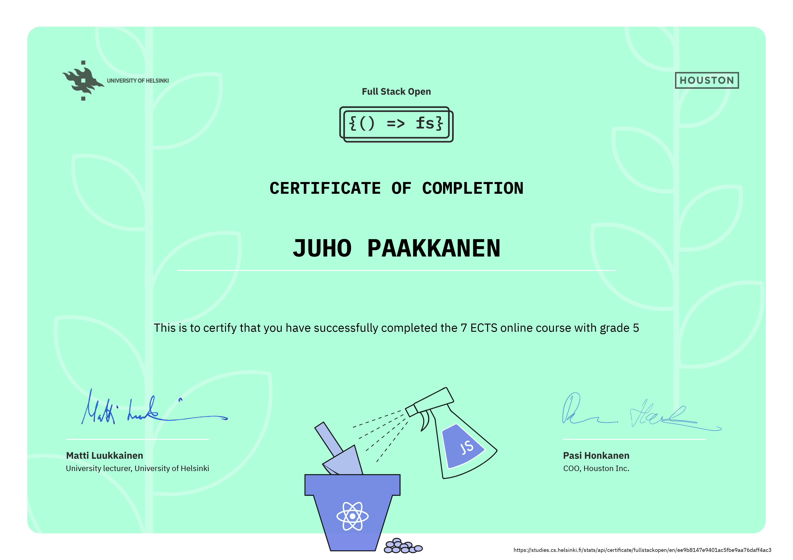

# Full stack open - Core 

This is the main repo for returning exercices for University of Helsinki [Full Stack open 2022 course](https://fullstackopen.com/en/).

This course serves as an introduction to modern web application development with JavaScript. The main focus is on building single page applications with ReactJS that use REST APIs built with Node.js. The course also contains a section on GraphQL, a modern alternative to REST APIs.
The course covers testing, configuration and environment management, and the use of MongoDB for storing the application’s data.

Participants are expected to have good programming skills, basic knowledge of web programming and databases, and to know the basics of working with the Git version-control system. You are also expected to have perseverance and the ability for independent problem solving and information seeking.

### [Course contents](https://fullstackopen.com/en/#course-contents)

Other modules parts:
[React Native](https://github.com/juhopaakkanen/fso-rate-repository-app)
[CI/CD](https://github.com/juhopaakkanen/fso-pokedex)
[Containers](https://github.com/juhopaakkanen/fso-containers-applications)
[Relational Databases](https://github.com/juhopaakkanen/fso-relational-databases)
